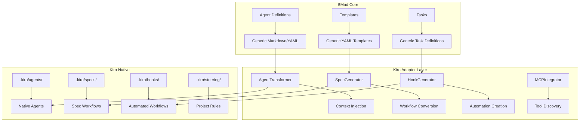

# BMad Method Kiro Integration Developer Guide

## Overview

This guide provides technical documentation for developers working with BMad Method's Kiro integration, including architecture details, API references, and expansion pack development.

## Integration Architecture

### Core Components

The Kiro integration is built around a transformation layer that adapts BMad's generic components to leverage Kiro's specific capabilities:

```
BMad Core → Kiro Adapter → Kiro Native Components
```

#### Component Hierarchy



### File Structure

```
tools/kiro-adapter/
├── agent-transformer.js          # Core agent transformation
├── spec-generator.js             # BMad workflow → Kiro spec conversion
├── context-injector.js           # Kiro context system integration
├── hook-generator.js             # Automated workflow creation
├── mcp-integrator.js             # MCP tool discovery and integration
├── steering-integrator.js        # Steering rule management
├── collaborative-planning.js     # Team workflow support
├── kiro-detector.js              # Kiro environment detection
├── kiro-installer.js             # Installation and upgrade logic
├── kiro-validator.js             # Validation and error handling
├── installation-error-handler.js # Installation error management
├── runtime-error-handler.js      # Runtime error handling
└── __tests__/                    # Comprehensive test suite
```

## API Reference

### AgentTransformer

Transforms BMad agent definitions into Kiro-native agents with enhanced context awareness.

#### Class Definition

```javascript
class AgentTransformer {
  constructor(options = {}) {
    this.options = {
      preservePersona: true,
      injectContext: true,
      addSteeringRules: true,
      enableMCPTools: true,
      ...options
    };
  }
}
```

#### Methods

##### `transformAgent(bmadAgentPath, kiroOutputPath, options = {})`

Transforms a single BMad agent into a Kiro-native agent.

**Parameters:**
- `bmadAgentPath` (string): Path to BMad agent markdown file
- `kiroOutputPath` (string): Output path for Kiro agent file
- `options` (object): Transformation options

**Returns:** Promise<TransformationResult>

**Example:**
```javascript
const transformer = new AgentTransformer();
const result = await transformer.transformAgent(
  'bmad-core/agents/pm.md',
  '.kiro/agents/bmad-pm.md',
  { 
    contextProviders: ['#File', '#Codebase', '#Problems'],
    steeringRules: ['product.md', 'tech.md']
  }
);
```

##### `injectContextAwareness(agentContent, contextProviders = [])`

Injects Kiro context provider references into agent content.

**Parameters:**
- `agentContent` (string): Original agent content
- `contextProviders` (array): List of Kiro context providers to inject

**Returns:** string - Modified agent content

##### `addSteeringIntegration(agentContent, steeringRules = [])`

Adds steering rule integration to agent prompts.

**Parameters:**
- `agentContent` (string): Agent content to modify
- `steeringRules` (array): List of steering rule files to reference

**Returns:** string - Modified agent content

### SpecGenerator

Converts BMad planning workflows into native Kiro specs.

#### Class Definition

```javascript
class SpecGenerator {
  constructor(options = {}) {
    this.options = {
      generateRequirements: true,
      generateDesign: true,
      generateTasks: true,
      includeTaskStatus: true,
      ...options
    };
  }
}
```

#### Methods

##### `generateSpecFromBMadWorkflow(workflowPath, specOutputPath)`

Generates a complete Kiro spec from a BMad workflow definition.

**Parameters:**
- `workflowPath` (string): Path to BMad workflow YAML file
- `specOutputPath` (string): Output directory for Kiro spec

**Returns:** Promise<SpecGenerationResult>

**Example:**
```javascript
const generator = new SpecGenerator();
const result = await generator.generateSpecFromBMadWorkflow(
  'bmad-core/workflows/greenfield-fullstack.yaml',
  '.kiro/specs/my-project'
);
```

##### `createRequirementsFromPRD(prdTemplate, outputPath)`

Converts BMad PRD template to Kiro requirements.md format.

**Parameters:**
- `prdTemplate` (object): Parsed BMad PRD template
- `outputPath` (string): Output path for requirements.md

**Returns:** Promise<void>

##### `createTasksFromStories(storiesData, outputPath)`

Converts BMad development stories to Kiro tasks.md format.

**Parameters:**
- `storiesData` (array): Array of BMad story objects
- `outputPath` (string): Output path for tasks.md

**Returns:** Promise<void>

### HookGenerator

Creates intelligent Kiro hooks for BMad workflow automation.

#### Class Definition

```javascript
class HookGenerator {
  constructor(options = {}) {
    this.options = {
      generateProgressionHooks: true,
      generateReviewHooks: true,
      generateGitHooks: true,
      generateManualHooks: true,
      ...options
    };
  }
}
```

#### Methods

##### `generateWorkflowHooks(workflowConfig, outputDir)`

Generates a complete set of hooks for a BMad workflow.

**Parameters:**
- `workflowConfig` (object): BMad workflow configuration
- `outputDir` (string): Output directory for hook files

**Returns:** Promise<HookGenerationResult>

**Example:**
```javascript
const hookGenerator = new HookGenerator();
const result = await hookGenerator.generateWorkflowHooks(
  workflowConfig,
  '.kiro/hooks'
);
```

##### `createProgressionHook(storySequence, outputPath)`

Creates a hook for automatic story progression.

**Parameters:**
- `storySequence` (array): Sequence of BMad stories
- `outputPath` (string): Output path for hook file

**Returns:** Promise<void>

### MCPIntegrator

Discovers and integrates MCP tools with BMad agents.

#### Class Definition

```javascript
class MCPIntegrator {
  constructor(kiroConfigPath = '.kiro/settings/mcp.json') {
    this.kiroConfigPath = kiroConfigPath;
    this.availableTools = new Map();
  }
}
```

#### Methods

##### `discoverMCPTools()`

Discovers available MCP tools from Kiro configuration.

**Returns:** Promise<Map<string, MCPToolConfig>>

##### `mapAgentToMCPTools(agentType)`

Maps BMad agent types to appropriate MCP tools.

**Parameters:**
- `agentType` (string): BMad agent type ('pm', 'architect', 'dev', etc.)

**Returns:** Array<string> - List of recommended MCP tool names

**Example:**
```javascript
const integrator = new MCPIntegrator();
const tools = integrator.mapAgentToMCPTools('analyst');
// Returns: ['web-search', 'documentation', 'data-analysis']
```

## Expansion Pack Development

### Creating Kiro-Compatible Expansion Packs

Expansion packs can leverage Kiro integration by following these patterns:

#### Directory Structure

```
expansion-packs/my-domain-pack/
├── config.yaml                   # Pack configuration
├── agents/                       # Domain-specific agents
├── templates/                    # Domain templates
├── tasks/                        # Domain tasks
├── kiro-integration/             # Kiro-specific enhancements
│   ├── steering-templates/       # Default steering rules
│   ├── hook-templates/           # Automation hooks
│   └── mcp-recommendations.json  # Recommended MCP tools
└── examples/                     # Example projects
```

#### Kiro Integration Configuration

Create `kiro-integration/config.yaml`:

```yaml
# Kiro Integration Configuration
name: "My Domain Pack"
version: "1.0.0"
kiro_features:
  steering_rules:
    - name: "domain-conventions.md"
      template: "steering-templates/domain-conventions.md"
      inclusion: "always"
    - name: "domain-tech-stack.md"
      template: "steering-templates/tech-stack.md"
      inclusion: "fileMatch"
      fileMatchPattern: "src/**/*.domain"
  
  hooks:
    - name: "domain-workflow-progression"
      template: "hook-templates/workflow-progression.yaml"
      trigger: "task_completion"
    - name: "domain-validation"
      template: "hook-templates/validation.yaml"
      trigger: "file_save"
      pattern: "**/*.domain"
  
  mcp_tools:
    recommended:
      - "domain-specific-api"
      - "domain-validator"
      - "domain-documentation"
    required:
      - "domain-specific-api"

context_providers:
  - "#File"
  - "#Codebase"
  - "#Problems"
  - "#Git Diff"

agent_enhancements:
  context_injection: true
  steering_integration: true
  mcp_integration: true
```

#### Agent Enhancement

Expansion pack agents automatically inherit Kiro integration:

```markdown
---
name: "Domain Expert"
role: "Domain Specialist"
expansion_pack: "my-domain-pack"
kiro_integration:
  context_providers:
    - "#File"
    - "#Codebase"
  steering_rules:
    - "domain-conventions.md"
  mcp_tools:
    - "domain-specific-api"
---

# Domain Expert Agent

I am your Domain Expert, specialized in [domain] development with full Kiro integration.

## Kiro Context Awareness
I automatically access:
- Current project files and structure
- Domain-specific conventions from steering rules
- External domain tools via MCP integration

[Rest of agent definition...]
```

### Testing Expansion Pack Integration

Create comprehensive tests for Kiro integration:

```javascript
// __tests__/kiro-integration.test.js
describe('Expansion Pack Kiro Integration', () => {
  test('should install with Kiro enhancements', async () => {
    const installer = new KiroInstaller();
    const result = await installer.installExpansionPack(
      'my-domain-pack',
      { ide: 'kiro' }
    );
    
    expect(result.agents).toHaveLength(3);
    expect(result.steeringRules).toHaveLength(2);
    expect(result.hooks).toHaveLength(2);
  });

  test('should generate domain-specific specs', async () => {
    const specGenerator = new SpecGenerator();
    const result = await specGenerator.generateSpecFromBMadWorkflow(
      'expansion-packs/my-domain-pack/workflows/domain-workflow.yaml',
      '.kiro/specs/domain-project'
    );
    
    expect(result.requirements).toBeDefined();
    expect(result.design).toBeDefined();
    expect(result.tasks).toHaveLength(10);
  });
});
```

## Error Handling and Validation

### Installation Error Handling

The integration includes comprehensive error handling for installation issues:

```javascript
// installation-error-handler.js
class InstallationErrorHandler {
  static async handleKiroDetectionFailure(error) {
    return {
      success: false,
      error: 'KIRO_NOT_DETECTED',
      message: 'Kiro workspace not found. Please initialize a Kiro workspace first.',
      suggestions: [
        'Run `kiro init` to create a new Kiro workspace',
        'Ensure you are in a directory with a .kiro folder',
        'Check Kiro IDE installation'
      ]
    };
  }

  static async handleAgentTransformationError(error, agentPath) {
    return {
      success: false,
      error: 'AGENT_TRANSFORMATION_FAILED',
      message: `Failed to transform agent: ${agentPath}`,
      details: error.message,
      suggestions: [
        'Check agent YAML header format',
        'Validate agent markdown syntax',
        'Ensure all dependencies are available'
      ]
    };
  }
}
```

### Runtime Error Handling

Runtime errors are handled gracefully with fallback options:

```javascript
// runtime-error-handler.js
class RuntimeErrorHandler {
  static async handleContextProviderError(error, provider) {
    console.warn(`Context provider ${provider} unavailable:`, error.message);
    return {
      fallback: 'manual_context',
      message: `Please provide context manually using ${provider} in chat`
    };
  }

  static async handleMCPToolError(error, toolName) {
    return {
      fallback: 'alternative_workflow',
      message: `MCP tool ${toolName} unavailable. Consider installing: uvx ${toolName}`,
      alternatives: this.getAlternativeWorkflows(toolName)
    };
  }
}
```

### Validation System

Comprehensive validation ensures integration integrity:

```javascript
// kiro-validator.js
class KiroValidator {
  static async validateInstallation(installPath) {
    const checks = [
      this.checkKiroWorkspace(installPath),
      this.checkAgentFiles(installPath),
      this.checkSteeringRules(installPath),
      this.checkHookConfiguration(installPath)
    ];

    const results = await Promise.all(checks);
    return {
      valid: results.every(r => r.valid),
      checks: results
    };
  }

  static async validateAgentTransformation(agentPath) {
    // Validate YAML header
    // Check context provider references
    // Verify steering rule integration
    // Validate MCP tool mappings
  }
}
```

## Performance Considerations

### Context Loading Optimization

```javascript
// Lazy load context providers
class ContextOptimizer {
  static async optimizeContextLoading(contextProviders) {
    const prioritized = this.prioritizeContextProviders(contextProviders);
    const cached = await this.loadCachedContext(prioritized);
    const fresh = await this.loadFreshContext(prioritized.filter(p => !cached.has(p)));
    
    return new Map([...cached, ...fresh]);
  }
}
```

### Hook Execution Performance

```javascript
// Debounce hook execution to prevent excessive triggering
class HookOptimizer {
  static createDebouncedHook(hookConfig, delay = 1000) {
    return debounce(async (event) => {
      await this.executeHook(hookConfig, event);
    }, delay);
  }
}
```

## Contributing to Kiro Integration

### Development Setup

1. **Clone the repository:**
   ```bash
   git clone https://github.com/bmad-method/bmad-method.git
   cd bmad-method
   ```

2. **Install dependencies:**
   ```bash
   npm install
   ```

3. **Set up test environment:**
   ```bash
   cd tools/kiro-adapter
   npm test
   ```

### Testing Guidelines

- Write unit tests for all transformation logic
- Include integration tests for end-to-end workflows
- Add performance tests for large codebase scenarios
- Test error handling and edge cases

### Code Style

- Follow existing code patterns in the kiro-adapter directory
- Use descriptive variable and function names
- Include comprehensive JSDoc comments
- Maintain backward compatibility with existing BMad installations

## Advanced Topics

### Custom Context Providers

Create custom context providers for domain-specific needs:

```javascript
class CustomContextProvider {
  static async provideDomainContext(projectPath) {
    // Analyze domain-specific files
    // Extract relevant context
    // Return structured context data
  }
}
```

### Advanced Hook Patterns

Create sophisticated automation workflows:

```yaml
# Complex hook with multiple triggers and conditions
name: "Advanced Workflow Hook"
triggers:
  - type: "file_change"
    pattern: "src/**/*.js"
    condition: "tests_passing"
  - type: "git_commit"
    condition: "feature_branch"
actions:
  - agent: "bmad-qa"
    task: "review-changes"
    context: ["#Git Diff", "#Problems"]
  - agent: "bmad-dev"
    task: "update-documentation"
    condition: "api_changes_detected"
```

### MCP Tool Development

Develop custom MCP tools for BMad integration:

```javascript
// Custom MCP server for BMad-specific functionality
class BMadMCPServer {
  async handleToolCall(toolName, parameters) {
    switch (toolName) {
      case 'bmad-story-generator':
        return this.generateStory(parameters);
      case 'bmad-architecture-validator':
        return this.validateArchitecture(parameters);
      default:
        throw new Error(`Unknown tool: ${toolName}`);
    }
  }
}
```

## Migration Guide

### From Generic IDE to Kiro

If you have an existing BMad installation, migrate to Kiro integration:

1. **Backup existing configuration:**
   ```bash
   cp -r .bmad .bmad-backup
   ```

2. **Install Kiro integration:**
   ```bash
   npx bmad-method install --ide=kiro --migrate
   ```

3. **Verify migration:**
   ```bash
   npx bmad-method validate --ide=kiro
   ```

### Handling Migration Conflicts

The migration process handles common conflicts:

- **Agent customizations**: Preserved and merged with Kiro enhancements
- **Custom templates**: Converted to Kiro spec format
- **Workflow modifications**: Adapted to Kiro hook system

## Support and Resources

### Documentation
- [User Guide](kiro-integration-user-guide.md) - End-user documentation
- [API Reference](#api-reference) - This document
- [Examples](../examples/kiro-integration/) - Sample projects and templates

### Community
- GitHub Issues: Bug reports and feature requests
- Discussions: Community support and questions
- Contributing: Guidelines for code contributions

### Professional Support
- Enterprise consulting for large-scale implementations
- Custom expansion pack development
- Training and workshops