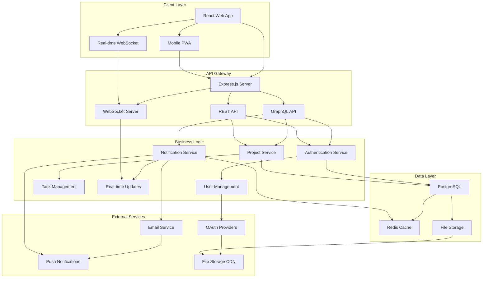

# Task Management Application Design Document

## Overview

This design document outlines the technical architecture for a scalable, real-time task management application built with modern web technologies. The system emphasizes performance, security, and user experience while providing comprehensive project management capabilities.

## Architecture

### High-Level System Architecture



### Technology Stack

- **Frontend**: React 18 with TypeScript, Vite, TailwindCSS
- **Backend**: Node.js with Express.js, GraphQL (Apollo Server)
- **Database**: PostgreSQL with Prisma ORM
- **Caching**: Redis for session storage and real-time data
- **Real-time**: WebSocket connections with Socket.io
- **Authentication**: JWT tokens with refresh token rotation
- **File Storage**: AWS S3 or compatible object storage
- **Deployment**: Docker containers with Kubernetes orchestration

## Components and Interfaces

### 1. Frontend Architecture

#### Component Structure

```
src/frontend/
├── components/           # Reusable UI components
│   ├── common/          # Generic components (Button, Modal, etc.)
│   ├── forms/           # Form components with validation
│   └── layout/          # Layout components (Header, Sidebar)
├── pages/               # Route-level page components
│   ├── auth/            # Authentication pages
│   ├── dashboard/       # Dashboard and overview pages
│   ├── projects/        # Project management pages
│   └── tasks/           # Task management pages
├── hooks/               # Custom React hooks
├── services/            # API client and external service integrations
├── store/               # State management (Redux Toolkit)
├── types/               # TypeScript type definitions
└── utils/               # Utility functions and helpers
```

#### Key Frontend Components

**TaskCard Component**
```typescript
interface TaskCardProps {
  task: Task;
  onStatusChange: (taskId: string, status: TaskStatus) => void;
  onAssigneeChange: (taskId: string, assigneeId: string) => void;
  onPriorityChange: (taskId: string, priority: Priority) => void;
}

const TaskCard: React.FC<TaskCardProps> = ({ task, onStatusChange, onAssigneeChange, onPriorityChange }) => {
  // Component implementation with drag-and-drop support
  // Real-time updates via WebSocket
  // Optimistic UI updates
};
```

**ProjectDashboard Component**
```typescript
interface ProjectDashboardProps {
  projectId: string;
}

const ProjectDashboard: React.FC<ProjectDashboardProps> = ({ projectId }) => {
  // Real-time project statistics
  // Task progress visualization
  // Team activity feed
  // Performance metrics
};
```

### 2. Backend Architecture

#### Service Layer Structure

```
src/backend/
├── controllers/         # HTTP request handlers
├── services/           # Business logic services
├── models/             # Database models and schemas
├── middleware/         # Express middleware functions
├── routes/             # API route definitions
├── graphql/            # GraphQL schema and resolvers
├── websocket/          # WebSocket event handlers
├── utils/              # Utility functions
└── config/             # Configuration management
```

#### Core Services

**AuthenticationService**
```typescript
class AuthenticationService {
  async register(userData: RegisterInput): Promise<AuthResult> {
    // Hash password with bcrypt
    // Create user record
    // Send verification email
    // Generate JWT tokens
  }

  async login(credentials: LoginInput): Promise<AuthResult> {
    // Validate credentials
    // Check account status
    // Generate JWT tokens with refresh
    // Log security event
  }

  async refreshToken(refreshToken: string): Promise<TokenPair> {
    // Validate refresh token
    // Generate new access token
    // Rotate refresh token
  }
}
```

**TaskService**
```typescript
class TaskService {
  async createTask(taskData: CreateTaskInput, userId: string): Promise<Task> {
    // Validate task data
    // Check project permissions
    // Create task record
    // Send notifications
    // Broadcast real-time update
  }

  async updateTaskStatus(taskId: string, status: TaskStatus, userId: string): Promise<Task> {
    // Validate permissions
    // Update task status
    // Log activity
    // Trigger workflow rules
    // Broadcast update
  }

  async getTasksByProject(projectId: string, filters: TaskFilters): Promise<Task[]> {
    // Apply access control
    // Build query with filters
    // Execute with pagination
    // Return formatted results
  }
}
```

**NotificationService**
```typescript
class NotificationService {
  async sendTaskAssignment(task: Task, assignee: User): Promise<void> {
    // Create notification record
    // Send email notification
    // Send push notification
    // Broadcast real-time update
  }

  async sendDueDateReminder(tasks: Task[]): Promise<void> {
    // Process batch notifications
    // Send personalized reminders
    // Update notification status
  }
}
```

### 3. Database Schema

#### Core Entities

```sql
-- Users table
CREATE TABLE users (
  id UUID PRIMARY KEY DEFAULT gen_random_uuid(),
  email VARCHAR(255) UNIQUE NOT NULL,
  password_hash VARCHAR(255) NOT NULL,
  first_name VARCHAR(100) NOT NULL,
  last_name VARCHAR(100) NOT NULL,
  avatar_url VARCHAR(500),
  email_verified BOOLEAN DEFAULT FALSE,
  created_at TIMESTAMP DEFAULT NOW(),
  updated_at TIMESTAMP DEFAULT NOW()
);

-- Projects table
CREATE TABLE projects (
  id UUID PRIMARY KEY DEFAULT gen_random_uuid(),
  name VARCHAR(200) NOT NULL,
  description TEXT,
  owner_id UUID REFERENCES users(id),
  status VARCHAR(50) DEFAULT 'active',
  created_at TIMESTAMP DEFAULT NOW(),
  updated_at TIMESTAMP DEFAULT NOW()
);

-- Tasks table
CREATE TABLE tasks (
  id UUID PRIMARY KEY DEFAULT gen_random_uuid(),
  title VARCHAR(300) NOT NULL,
  description TEXT,
  project_id UUID REFERENCES projects(id),
  assignee_id UUID REFERENCES users(id),
  creator_id UUID REFERENCES users(id),
  status VARCHAR(50) DEFAULT 'todo',
  priority VARCHAR(20) DEFAULT 'medium',
  due_date TIMESTAMP,
  completed_at TIMESTAMP,
  created_at TIMESTAMP DEFAULT NOW(),
  updated_at TIMESTAMP DEFAULT NOW()
);

-- Project members table
CREATE TABLE project_members (
  id UUID PRIMARY KEY DEFAULT gen_random_uuid(),
  project_id UUID REFERENCES projects(id),
  user_id UUID REFERENCES users(id),
  role VARCHAR(50) DEFAULT 'member',
  joined_at TIMESTAMP DEFAULT NOW(),
  UNIQUE(project_id, user_id)
);
```

#### Prisma Schema

```prisma
model User {
  id            String    @id @default(cuid())
  email         String    @unique
  passwordHash  String    @map("password_hash")
  firstName     String    @map("first_name")
  lastName      String    @map("last_name")
  avatarUrl     String?   @map("avatar_url")
  emailVerified Boolean   @default(false) @map("email_verified")
  createdAt     DateTime  @default(now()) @map("created_at")
  updatedAt     DateTime  @updatedAt @map("updated_at")

  ownedProjects    Project[]       @relation("ProjectOwner")
  projectMembers   ProjectMember[]
  assignedTasks    Task[]          @relation("TaskAssignee")
  createdTasks     Task[]          @relation("TaskCreator")
  comments         Comment[]
  notifications    Notification[]

  @@map("users")
}

model Project {
  id          String    @id @default(cuid())
  name        String
  description String?
  ownerId     String    @map("owner_id")
  status      String    @default("active")
  createdAt   DateTime  @default(now()) @map("created_at")
  updatedAt   DateTime  @updatedAt @map("updated_at")

  owner     User            @relation("ProjectOwner", fields: [ownerId], references: [id])
  members   ProjectMember[]
  tasks     Task[]

  @@map("projects")
}

model Task {
  id          String    @id @default(cuid())
  title       String
  description String?
  projectId   String    @map("project_id")
  assigneeId  String?   @map("assignee_id")
  creatorId   String    @map("creator_id")
  status      String    @default("todo")
  priority    String    @default("medium")
  dueDate     DateTime? @map("due_date")
  completedAt DateTime? @map("completed_at")
  createdAt   DateTime  @default(now()) @map("created_at")
  updatedAt   DateTime  @updatedAt @map("updated_at")

  project   Project   @relation(fields: [projectId], references: [id])
  assignee  User?     @relation("TaskAssignee", fields: [assigneeId], references: [id])
  creator   User      @relation("TaskCreator", fields: [creatorId], references: [id])
  comments  Comment[]

  @@map("tasks")
}
```

### 4. Real-time Communication

#### WebSocket Event System

```typescript
// WebSocket event types
interface WebSocketEvents {
  // Task events
  'task:created': (task: Task) => void;
  'task:updated': (task: Task) => void;
  'task:deleted': (taskId: string) => void;
  'task:assigned': (task: Task, assignee: User) => void;

  // Project events
  'project:updated': (project: Project) => void;
  'project:member_added': (project: Project, member: User) => void;
  'project:member_removed': (project: Project, memberId: string) => void;

  // Comment events
  'comment:added': (comment: Comment) => void;
  'comment:updated': (comment: Comment) => void;

  // Notification events
  'notification:new': (notification: Notification) => void;
  'notification:read': (notificationId: string) => void;
}

// WebSocket server implementation
class WebSocketServer {
  private io: Server;

  constructor(server: http.Server) {
    this.io = new Server(server, {
      cors: { origin: process.env.CLIENT_URL }
    });
    
    this.setupEventHandlers();
  }

  private setupEventHandlers(): void {
    this.io.on('connection', (socket) => {
      socket.on('join:project', (projectId: string) => {
        socket.join(`project:${projectId}`);
      });

      socket.on('leave:project', (projectId: string) => {
        socket.leave(`project:${projectId}`);
      });
    });
  }

  broadcastToProject(projectId: string, event: string, data: any): void {
    this.io.to(`project:${projectId}`).emit(event, data);
  }
}
```

## Data Models

### Core Data Types

```typescript
// User types
interface User {
  id: string;
  email: string;
  firstName: string;
  lastName: string;
  avatarUrl?: string;
  emailVerified: boolean;
  createdAt: Date;
  updatedAt: Date;
}

interface CreateUserInput {
  email: string;
  password: string;
  firstName: string;
  lastName: string;
}

// Project types
interface Project {
  id: string;
  name: string;
  description?: string;
  ownerId: string;
  status: ProjectStatus;
  createdAt: Date;
  updatedAt: Date;
  owner: User;
  members: ProjectMember[];
  tasks: Task[];
}

enum ProjectStatus {
  ACTIVE = 'active',
  ARCHIVED = 'archived',
  DELETED = 'deleted'
}

// Task types
interface Task {
  id: string;
  title: string;
  description?: string;
  projectId: string;
  assigneeId?: string;
  creatorId: string;
  status: TaskStatus;
  priority: TaskPriority;
  dueDate?: Date;
  completedAt?: Date;
  createdAt: Date;
  updatedAt: Date;
  project: Project;
  assignee?: User;
  creator: User;
  comments: Comment[];
}

enum TaskStatus {
  TODO = 'todo',
  IN_PROGRESS = 'in_progress',
  IN_REVIEW = 'in_review',
  DONE = 'done'
}

enum TaskPriority {
  LOW = 'low',
  MEDIUM = 'medium',
  HIGH = 'high',
  URGENT = 'urgent'
}
```

## Error Handling

### Error Classification

```typescript
// Custom error classes
class AppError extends Error {
  public statusCode: number;
  public isOperational: boolean;

  constructor(message: string, statusCode: number) {
    super(message);
    this.statusCode = statusCode;
    this.isOperational = true;
    Error.captureStackTrace(this, this.constructor);
  }
}

class ValidationError extends AppError {
  constructor(message: string) {
    super(message, 400);
  }
}

class AuthenticationError extends AppError {
  constructor(message: string = 'Authentication failed') {
    super(message, 401);
  }
}

class AuthorizationError extends AppError {
  constructor(message: string = 'Access denied') {
    super(message, 403);
  }
}

class NotFoundError extends AppError {
  constructor(resource: string) {
    super(`${resource} not found`, 404);
  }
}
```

### Global Error Handler

```typescript
// Express error handling middleware
const errorHandler = (
  error: Error,
  req: Request,
  res: Response,
  next: NextFunction
): void => {
  let statusCode = 500;
  let message = 'Internal server error';

  if (error instanceof AppError) {
    statusCode = error.statusCode;
    message = error.message;
  }

  // Log error for monitoring
  logger.error({
    error: error.message,
    stack: error.stack,
    url: req.url,
    method: req.method,
    userId: req.user?.id
  });

  res.status(statusCode).json({
    success: false,
    error: {
      message,
      ...(process.env.NODE_ENV === 'development' && { stack: error.stack })
    }
  });
};
```

## Testing Strategy

### Testing Pyramid

```
    /\
   /  \     E2E Tests (Cypress)
  /____\    - User workflows
 /      \   - Integration scenarios
/________\  
           Integration Tests (Jest + Supertest)
           - API endpoints
           - Database operations
           - WebSocket events

           Unit Tests (Jest + React Testing Library)
           - Components
           - Services
           - Utilities
```

### Test Configuration

```typescript
// Jest configuration for backend
export default {
  preset: 'ts-jest',
  testEnvironment: 'node',
  setupFilesAfterEnv: ['<rootDir>/src/test/setup.ts'],
  testMatch: ['**/__tests__/**/*.test.ts'],
  collectCoverageFrom: [
    'src/**/*.ts',
    '!src/**/*.d.ts',
    '!src/test/**/*'
  ],
  coverageThreshold: {
    global: {
      branches: 80,
      functions: 80,
      lines: 80,
      statements: 80
    }
  }
};

// React Testing Library configuration
export default {
  testEnvironment: 'jsdom',
  setupFilesAfterEnv: ['<rootDir>/src/test/setup.ts'],
  moduleNameMapping: {
    '\\.(css|less|scss|sass)$': 'identity-obj-proxy'
  },
  transform: {
    '^.+\\.(ts|tsx)$': 'ts-jest'
  }
};
```

### Example Tests

```typescript
// Unit test example
describe('TaskService', () => {
  let taskService: TaskService;
  let mockPrisma: jest.Mocked<PrismaClient>;

  beforeEach(() => {
    mockPrisma = createMockPrisma();
    taskService = new TaskService(mockPrisma);
  });

  describe('createTask', () => {
    it('should create a task with valid data', async () => {
      const taskData = {
        title: 'Test Task',
        description: 'Test Description',
        projectId: 'project-1',
        assigneeId: 'user-1'
      };

      mockPrisma.task.create.mockResolvedValue(mockTask);

      const result = await taskService.createTask(taskData, 'creator-1');

      expect(result).toEqual(mockTask);
      expect(mockPrisma.task.create).toHaveBeenCalledWith({
        data: expect.objectContaining(taskData)
      });
    });
  });
});

// Integration test example
describe('POST /api/tasks', () => {
  it('should create a new task', async () => {
    const taskData = {
      title: 'Integration Test Task',
      projectId: testProject.id
    };

    const response = await request(app)
      .post('/api/tasks')
      .set('Authorization', `Bearer ${authToken}`)
      .send(taskData)
      .expect(201);

    expect(response.body.data).toMatchObject(taskData);
  });
});
```

## Security Considerations

### Authentication & Authorization

- JWT tokens with short expiration and refresh token rotation
- Password hashing with bcrypt (minimum 12 rounds)
- Rate limiting on authentication endpoints
- Account lockout after failed attempts

### Data Protection

- Input validation and sanitization
- SQL injection prevention through parameterized queries
- XSS protection with Content Security Policy
- HTTPS enforcement in production

### API Security

- CORS configuration for allowed origins
- Request size limits to prevent DoS
- API rate limiting per user/IP
- Audit logging for sensitive operations

## Performance Optimization

### Database Optimization

- Proper indexing on frequently queried columns
- Connection pooling for database connections
- Query optimization and N+1 problem prevention
- Database query monitoring and slow query analysis

### Caching Strategy

- Redis caching for frequently accessed data
- Browser caching for static assets
- CDN for file storage and global distribution
- Application-level caching for computed results

### Frontend Performance

- Code splitting and lazy loading
- Image optimization and lazy loading
- Bundle size optimization
- Service worker for offline functionality

## Deployment Architecture

### Container Configuration

```dockerfile
# Multi-stage Docker build
FROM node:18-alpine AS builder
WORKDIR /app
COPY package*.json ./
RUN npm ci --only=production

FROM node:18-alpine AS runtime
WORKDIR /app
COPY --from=builder /app/node_modules ./node_modules
COPY . .
EXPOSE 3000
CMD ["npm", "start"]
```

### Kubernetes Deployment

```yaml
apiVersion: apps/v1
kind: Deployment
metadata:
  name: task-management-api
spec:
  replicas: 3
  selector:
    matchLabels:
      app: task-management-api
  template:
    metadata:
      labels:
        app: task-management-api
    spec:
      containers:
      - name: api
        image: task-management-api:latest
        ports:
        - containerPort: 3000
        env:
        - name: DATABASE_URL
          valueFrom:
            secretKeyRef:
              name: db-secret
              key: url
        - name: REDIS_URL
          valueFrom:
            secretKeyRef:
              name: redis-secret
              key: url
```

This design provides a solid foundation for building a scalable, maintainable task management application with modern web technologies and best practices.