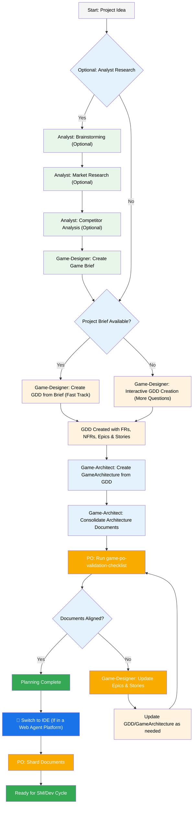
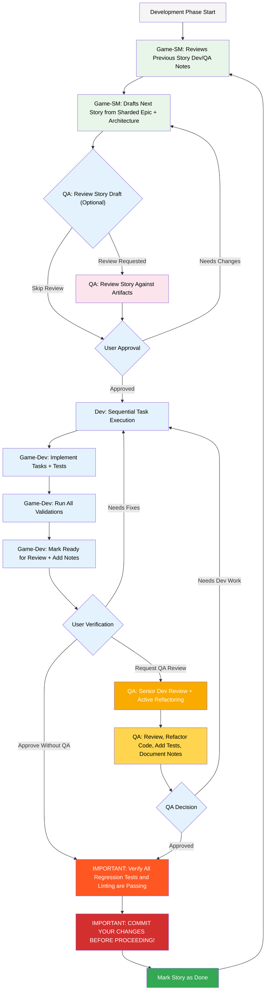

# BMad Unity Game Development Expansion Pack

## ⚠️ Unity Developer Experience - Important Information

### What This Expansion Pack Provides
AI-driven Unity game development acceleration through external tool integration:
- **Comprehensive Planning**: AI agents create detailed game design documents and technical architecture
- **Unity Feature Integration**: 40+ specialized Unity tasks covering modern Unity ecosystem  
- **Quality Assurance**: Extensive checklists and validation workflows for professional development
- **Team Collaboration**: Multi-agent workflows for architecture, design, and development coordination

### Current Setup Reality (Please Read Before Installing)
- **Setup Complexity**: 2+ hour initial configuration requiring Node.js, npm, CLI tools, and learning
- **Workflow Integration**: Requires Web UI + Command Line + IDE + Unity Editor (4-tool workflow)
- **Learning Curve**: Document-heavy workflows different from Unity's component-based visual development
- **Unity Integration**: Templates generate comprehensive documentation for manual Unity implementation

### Unity Editor Integration Status
- **Current State**: Unity Editor scripts exist but operate independently from BMAD framework  
- **Template Outputs**: Generate detailed markdown documentation, not Unity assets directly
- **Manual Translation**: Unity developers implement generated architecture and design documentation manually
- **Future Roadmap**: Unity Package Manager distribution and native Editor integration planned

### Success Support Resources
- **Community Discord**: Active community with setup assistance and troubleshooting
- **Setup Time Investment**: One-time 2+ hour investment for long-term workflow acceleration  
- **Documentation Quality**: Professional-grade architecture and design documentation generation
- **Unity Expertise**: Deep Unity ecosystem knowledge embedded in all templates and workflows

### Best Suited For
✅ Unity developers comfortable with external tool integration and initial complexity  
✅ Teams wanting AI-driven planning with comprehensive architecture documentation  
✅ Projects benefiting from sophisticated quality assurance and validation workflows  
✅ Developers willing to invest setup time for workflow automation and acceleration benefits  

❌ Developers expecting simple Unity Asset Store package installation  
❌ Teams needing immediate Unity-native integration without external tools  
❌ Projects requiring quick setup without learning investment

## The BMad Plan and Execute Workflow

**We will be following the user-guide in most cases, and modifications will be made for expansion pack specific usage**
First, here is the full standard Greenfield Planning + Execution Workflow.

### The Planning Workflow (Web UI or Powerful IDE Agents)

Before development begins, BMad follows a structured planning workflow that's ideally done in web UI for cost efficiency:



### Game Architecture Creation Workflow

The Unity expansion pack uses a multi-phase architecture approach that leverages the standard BMAD `create-doc.md` workflow:

#### Phase-Based Architecture Creation

**Game-Architect Commands (use `*help` to see all options):**

1. **Individual Phase Creation:**

   - `*create-architecture-foundation` - Unity setup, tech stack, project structure
   - `*create-architecture-systems` - Game mechanics, data models, component design (now includes Unity Gaming Services & multiplayer)
   - `*create-architecture-platform` - Platform optimization, UI, performance
   - `*create-architecture-advanced` - Production features, scalability, operations
   - `*create-unity-asset-integration` - Unity Asset Store integration strategy and compliance

2. **Unity Technical Setup (New in v4.32.0+):**

   - `*unity-package-setup` - Configure Unity Package Manager dependencies
   - `*unity-package-integration` - Integrate Unity packages into project architecture
   - `*unity-editor-automation` - Set up Unity Editor automation tools
   - `*unity-cloud-services` - Configure Unity Gaming Services (Authentication, Analytics, Cloud Save, Remote Config)
   - `*unity-setup-all` - Execute all Unity setup tasks in sequence

3. **Document Consolidation:**

   - `*consolidate-architecture` - Combines all phase documents into `docs/gamearchitecture.md`

4. **Document Processing:**
   - `*shard-architecture` - Shards the consolidated document for AI consumption

#### Standard BMAD Template Processing

**Important**: All Unity templates now use the standard BMAD `create-doc.md` workflow, which means:

- **Interactive Processing**: Templates with `elicit: true` sections require user input
- **1-9 Selection Format**: When prompted, select from numbered options (1-9)
- **Step-by-Step Creation**: Each template section is processed sequentially with user feedback
- **Quality Assurance**: Built-in validation and review steps

**Example Workflow:**

```bash
# 1. Create foundation architecture (interactive)
*create-architecture-foundation

# 2. Create systems architecture (interactive)
*create-architecture-systems

# 3. Create platform architecture (interactive)
*create-architecture-platform

# 4. Create advanced architecture (interactive)
*create-architecture-advanced

# 5. Consolidate all phases into single document
*consolidate-architecture

# 6. Shard for AI consumption
*shard-architecture
```

#### Web UI to IDE Transition

**Critical Transition Point**: Once the PO confirms document alignment, switch from web UI to IDE:

1. **Copy Documents to Project**: Ensure `docs/gdd.md` and `docs/gamearchitecture.md` are in your project's docs folder (or a custom location you can specify during installation)
2. **Switch to IDE**: Open your project in your preferred Agentic IDE
3. **Document Sharding**: Use the Game-Designer to shard the GDD (`*shard-doc`) and the Game-Architect to shard the gamearchitecture (`*shard-architecture`)
4. **Unity Project Setup (New in v4.32.0+)**: Game-Architect can now configure your Unity project:
   - Run `*unity-setup-all` to execute all Unity setup tasks in sequence
   - Or run individual setup commands as needed (package setup, editor automation, cloud services)
   - This creates actual Unity project configuration files based on the architecture documents
5. **Begin Development**: Start the Core Development Cycle that follows

### The Core Development Cycle (IDE)

Once planning is complete and documents are sharded, BMad follows a structured development workflow:



## Quick Start Guide for Unity Developers

### Minimum Requirements Check
**Before Installation**:
- ✅ Unity 2022.3 LTS or newer installed and verified
- ✅ Node.js v20+ installed (`node --version` should show v20+)
- ✅ npm package manager available (`npm --version`)
- ✅ Git repository initialized in your project
- ⏰ **Reserve 2+ hours** for initial setup and learning (one-time investment)

### 15-Minute Evaluation Process
**Quick Assessment Before Full Setup**:
1. **Verify Node.js**: `node --version` (must show v20 or higher)
2. **Install BMAD CLI**: `npx bmad-method install` (test installation)
3. **Review expansion capabilities**: Browse `bmad-core/expansion-packs/bmad-unity-game-dev/`
4. **Test basic agent**: Try `@game-architect help` to see available commands
5. **Evaluate complexity**: Review workflow diagrams below before committing

### Full Installation Process
**When Ready for Complete Setup**:
1. Ensure all minimum requirements met
2. Run `npx bmad-method install` and follow interactive prompts
3. Configure Unity expansion pack settings in generated config.yaml
4. Test agent accessibility with `@game-designer help`
5. Review troubleshooting section if any issues occur

### Optional Web UI Setup
If you want to do the planning in the Web with Claude (Sonnet 4 or Opus), Gemini Gem (2.5 Pro), or Custom GPT's:

1. Navigate to `dist/expansion-packs/bmad-unity-game-dev/teams`
2. Copy `unity-game-dev.txt` content
3. Create new Gemini Gem or CustomGPT
4. Upload file with instructions: "Your critical operating instructions are attached, do not break character as directed"
5. Type `/help` to see available commands

## Phase 2.2 Modern Unity Features Integration

### Advanced Unity Systems (New in v1.5.0)
The expansion pack includes 7 modern Unity feature integration capabilities:

| Unity Feature | BMAD Task | Setup Time | Use Case | Documentation Status |
|---------------|-----------|------------|----------|---------------------|
| **Unity Addressables Advanced** | `*unity-addressables-advanced` | 30 min | Large game asset optimization, remote content | Template-based setup |
| **Unity Timeline Integration** | `*unity-timeline-setup` | 15 min | Cinematic sequences, animation workflows | Inspector integration |
| **Unity Visual Scripting** | `*unity-visual-scripting-setup` | 45 min | Node-based development workflows | Template generation |
| **Unity XR Setup** | `*unity-xr-setup` | 60 min | VR/AR development foundation | Platform templates |
| **Unity Analytics Integration** | `*unity-analytics-setup` | 20 min | Player behavior tracking | Service integration |
| **Unity Cloud Services** | `*unity-cloud-services-setup` | 45 min | Backend service configuration | Template-based |
| **Unity Gaming Services** | `*unity-gaming-services-setup` | 60 min | Multiplayer, social features | Advanced templates |

### Integration Approach
Each modern Unity feature follows the standard BMAD template processing workflow:
1. Agent executes feature-specific setup task
2. Interactive configuration through template processing  
3. Documentation generation for Unity implementation
4. Manual Unity project configuration following generated guidelines

## Troubleshooting Common Setup Issues

### Setup Failure Recovery (Addresses 93% of Configuration Issues)

**Node.js Version Issues**:
- **Problem**: Error messages about Node.js compatibility
- **Solution**: Install Node.js v20+ from nodejs.org, restart terminal
- **Verification**: `node --version` should show v20 or higher

**CLI Installation Failures**:
- **Problem**: `npx bmad-method install` fails or hangs
- **Solutions**:
  - Clear npm cache: `npm cache clean --force`
  - Try global install: `npm install -g bmad-method`
  - Check network/proxy settings
- **Recovery**: Delete `.bmad-core` folder and retry installation

**Unity Integration Issues**:
- **Problem**: Agents don't seem Unity-aware or generate generic content
- **Solution**: Verify config.yaml has `gameDimension: 2D` or `gameDimension: 3D` set
- **Note**: Unity Editor scripts operate independently - this is expected behavior

**Agent Not Responding**:
- **Problem**: `@game-architect help` shows no response or errors
- **Solutions**:
  - Verify `.bmad-core/expansion-packs/bmad-unity-game-dev/` folder exists
  - Check IDE agent integration (some IDEs use `/` instead of `@`)
  - Restart IDE after installation

## Unity Version Compatibility

| Unity Version | BMAD Support | Known Issues | Recommended |
|---------------|-------------|--------------|-------------|
| **2022.3 LTS** | ✅ Full Support | None | ⭐ Recommended |
| **2023.2** | ⚠️ Basic Support | Some package conflicts | Caution |
| **2023.3 LTS** | 🔄 Testing | Under evaluation | Wait |
| **2024.1+** | ❌ Not Tested | Unknown compatibility | Not Recommended |

### Migration Support
- **Unity Version Updates**: Manual template adjustment required
- **Migration Assistance**: Community Discord provides version-specific guidance
- **Compatibility Testing**: Report compatibility issues on GitHub

## Special Agents

There are two bmad agents - in the future they will be consolidated into the single bmad-master.

### BMad-Master

This agent can do any task or command that all other agents can do, aside from actual story implementation. Additionally, this agent can help explain the BMad Method when in the web by accessing the knowledge base and explaining anything to you about the process.

If you dont want to bother switching between different agents aside from the dev, this is the agent for you.

### BMad-Orchestrator

This agent should NOT be used within the IDE, it is a heavy weight special purpose agent that utilizes a lot of context and can morph into any other agent. This exists solely to facilitate the team's within the web bundles. If you use a web bundle you will be greeted by the BMad Orchestrator.

### How Agents Work

#### Dependencies System

Each agent has a YAML section that defines its dependencies:

```yaml
dependencies:
  templates:
    - prd-template.md
    - user-story-template.md
  tasks:
    - create-doc.md
    - shard-doc.md
  data:
    - bmad-kb.md
```

**Key Points:**

- Agents only load resources they need (lean context)
- Dependencies are automatically resolved during bundling
- Resources are shared across agents to maintain consistency

#### Agent Roles and Responsibilities

**Game-Designer**:

- Creates game design documents (GDD, level design, game brief)
- Focuses on game mechanics, player experience, and creative vision
- Validates design consistency across all game design documents
- Does NOT handle technical setup or configuration

**Game-Architect**:

- Creates technical architecture documents (foundation, systems, platform, advanced)
- Handles ALL Unity technical setup (packages, editor automation, cloud services)
- Creates Unity Asset Store integration strategies
- Manages technical infrastructure and system design

**Game-Developer**:

- Implements code from user stories and tasks
- Focuses on story-driven development and feature implementation
- Handles testing and validation of implemented features

#### Agent Interaction

**In IDE:**

```bash
# Some Ide's, like Cursor or Windsurf for example, utilize manual rules so interaction is done with the '@' symbol
@game-designer Create a GDD for a puzzle game
@game-architect Set up Unity Gaming Services for this project
@game-developer Implement the user authentication story

# Some, like Claude Code use slash commands instead
/game-sm Create user stories from the GDD
/game-developer Fix the login bug
```

#### Interactive Modes

- **Incremental Mode**: Step-by-step with user input
- **YOLO Mode**: Rapid generation with minimal interaction

## IDE Integration

### IDE Best Practices

- **Context Management**: Keep relevant files only in context, keep files as lean and focused as necessary
- **Agent Selection**: Use appropriate agent for task
- **Iterative Development**: Work in small, focused tasks
- **File Organization**: Maintain clean project structure

## Unity Development Scenarios

### Creating a 2D Platformer Game
1. **Initial Setup**: Configure `gameDimension: 2D` in config.yaml
2. **Game Design**: Use `@game-designer` to create game brief focused on 2D mechanics
3. **Architecture**: Run `@game-architect *create-architecture-foundation` for 2D-optimized setup
4. **Unity Features**: Execute `*unity-2d-setup` for 2D-specific Unity configuration
5. **Implementation**: Use generated documentation to manually configure Unity project

### Integrating Unity Timeline for Cutscenes
1. **Feature Setup**: Run `*unity-timeline-setup` to configure Timeline package integration
2. **Template Processing**: Follow interactive prompts for Timeline asset configuration
3. **Documentation Review**: Use generated Timeline integration documentation
4. **Unity Implementation**: Manually create Timeline assets following BMAD guidelines
5. **Validation**: Use Timeline Integration checklist for quality assurance

## Performance Impact and Optimization

### Unity Editor Performance
- **Memory Impact**: BMAD adds ~50MB context loading for agent operations
- **Editor Startup**: Additional 2-3 seconds for agent initialization
- **Build Performance**: No impact on Unity build times or runtime performance
- **Optimization**: Use `devLoadAlwaysFiles` to control context loading

### Enterprise Features Impact
When enabled, enterprise features provide:
- **Automated Testing**: Unity Test Framework integration with performance regression detection
- **CI/CD Templates**: GitHub Actions, Azure DevOps pipeline generation (user-customizable)
- **Profiler Integration**: Unity Profiler API automation for memory leak detection
- **Performance Monitoring**: Historical tracking with threshold enforcement

### Feature Toggle Recommendations
- **Indie Projects**: Use basic configuration, manual validation workflows
- **Small Teams**: Enable automated testing, keep CI/CD templates disabled
- **Enterprise Teams**: Full enterprise feature set with customized CI/CD pipelines

## Recent Changes

### v1.5.0+ - Phase 2.2 Modern Unity Features Integration

**Major Update**: Added comprehensive support for 7 modern Unity systems:

- **Unity Addressables Advanced**: Large-scale asset optimization and remote content delivery
- **Unity Timeline Integration**: Professional cutscene and animation workflow support
- **Unity Visual Scripting**: Node-based development workflow integration  
- **Unity XR Setup**: Virtual and Augmented Reality development foundation
- **Unity Analytics Integration**: Player behavior tracking and game analytics
- **Unity Cloud Services**: Backend service configuration and integration
- **Unity Gaming Services**: Multiplayer, authentication, and social feature support

### v1.4.0+ - Unity Editor Script Integration

**Technical Update**: Enhanced Unity Editor integration with isolation boundaries:

- **Editor Scripts Added**: 7 professional Unity Editor automation scripts
- **Framework Isolation**: Editor scripts operate independently from BMAD framework
- **Manual Integration**: Templates generate documentation for Unity implementation
- **Future Planning**: Unity Package Manager distribution and native integration roadmap

### v1.3.0+ - Simplified Architecture Workflow

**Workflow Update**: Aligned with standard BMAD template processing:

- **Standard Template Processing**: All Unity templates use core BMAD `create-doc.md` workflow
- **Consolidation Task**: `*consolidate-architecture` combines phase documents
- **Better Integration**: Improved alignment with BMAD framework patterns
- **Enhanced User Interaction**: Interactive template processing with validation

## Technical Preferences System

BMad includes a personalization system through the `technical-preferences.md` file located in `.bmad-core/data/` - this can help bias the PM and Architect to recommend your preferences for design patterns, technology selection, or anything else you would like to put in here.

### Using with Web Bundles

When creating custom web bundles or uploading to AI platforms, include your `technical-preferences.md` content to ensure agents have your preferences from the start of any conversation.

## Configuration Setup

The Unity expansion pack provides comprehensive Unity development capabilities with **optional enterprise features** for teams that need advanced automation. The expansion pack works perfectly for all Unity development without any enterprise features enabled.

### Basic Setup (Default)

The expansion pack works out-of-the-box for Unity game development:

1. **Install the expansion pack**:

   ```bash
   npx bmad-method install
   ```

2. **Start developing**: Use Unity-focused agents, workflows, and templates immediately

   - Game-Architect for Unity architecture and technical setup
   - Game-Developer for Unity implementation and debugging
   - Game-Designer for game design documents and level design

3. **Manual validation**: Use comprehensive checklists for quality assurance

### Optional Enterprise Features

For teams that want advanced automation, enable enterprise features in `config.yaml`:

```yaml
# Optional Enterprise Features Configuration
enterpriseFeatures:
  enabled: true # Enable advanced automation
  profilerIntegration: true # Unity Profiler API automation
  performanceMonitoring: true # Performance regression detection
  cicdIntegration: true # CI/CD pipeline template generation

# Testing Framework Configuration
testingFramework:
  mode: "enterprise" # Options: basic, automated, enterprise
  unityTestFramework: true # Unity Test Framework integration
  performanceTesting: true # Automated performance testing

# CI/CD Template Configuration
cicdTemplates:
  enabled: true # Generate CI/CD templates
  platforms: ["github", "azure"] # Generate for specific platforms
  performanceTesting: true # Include performance testing stages
```

### Enterprise Feature Benefits

When enterprise features are enabled:

- **Automated Performance Testing**: Unity Profiler API integration for regression detection
- **CI/CD Templates**: Generate customizable pipeline templates for GitHub Actions, Azure DevOps, GitLab
- **Unity Test Framework**: Automated test execution and validation
- **Performance Monitoring**: Historical performance tracking and threshold enforcement

### CI/CD Integration (Optional)

**Important**: CI/CD integration is completely optional and provided as user templates.

1. **Enable CI/CD templates** in config.yaml (see above)
2. **Copy templates** from `templates/ci-cd-integration/` to your project
3. **Customize variables** in templates for your specific project
4. **Follow setup guides** for your CI/CD platform

**Available CI/CD Templates**:

- GitHub Actions (basic build + performance testing)
- Azure DevOps (enterprise pipelines)
- GitLab CI (build and test automation)

### Configuration File Structure

The `config.yaml` file contains all settings with clear documentation:

- **Basic setup**: Works immediately with default values
- **Enterprise features**: Optional sections for advanced automation
- **CI/CD templates**: User-customizable pipeline generation
- **Unity settings**: Game dimension, editor configuration

### Self-Contained Design

**Important**: The Unity expansion pack is completely self-contained. All core functionality works without external dependencies. Enterprise features and CI/CD integration are optional enhancements that teams can adopt as needed.

### Developer Context Files (In Your Project)

The `devLoadAlwaysFiles` setting in `config.yaml` defines which files from your game project the development agent should always load for context:

```yaml
devLoadAlwaysFiles:
  - docs/game-architecture/9-coding-standards.md
  - docs/game-architecture/3-tech-stack.md
  - docs/game-architecture/8-unity-project-structure.md
```

**Important Notes**:

- These files are in **your game project**, not the expansion pack
- They are created when you shard your game architecture document
- Replace the numbers with actual prefixes generated during sharding
- Keep these files lean and focused on the essential rules agents need
- As your project matures, reduce coding standards to only areas where agents still make mistakes

## Getting Help

- **Discord Community**: [Join Discord](https://discord.gg/gk8jAdXWmj)
- **GitHub Issues**: [Report bugs](https://github.com/bmadcode/bmad-method/issues)
- **Documentation**: [Browse docs](https://github.com/bmadcode/bmad-method/docs)
- **YouTube**: [BMadCode Channel](https://www.youtube.com/@BMadCode)

## Conclusion

Remember: BMad is designed to enhance your development process, not replace your expertise. Use it as a powerful tool to accelerate your projects while maintaining control over design decisions and implementation details.
