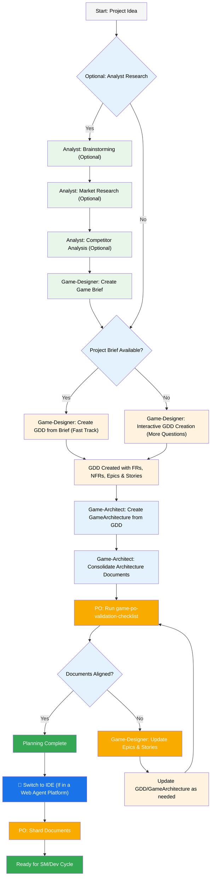
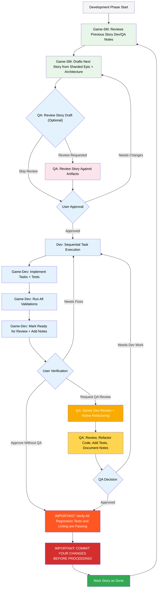

# BMad-Method BMAdUnity Expansion Code User Guide

This guide will help you understand and effectively use the BMad Method Unity Expansion Pack for agile ai driven planning and development.

## The BMad Plan and Execute Workflow

**We will be following the user-guide in most cases, and modifications will be made for expansion pack specific usage**
First, here is the full standard Greenfield Planning + Execution Workflow.

### The Planning Workflow (Web UI or Powerful IDE Agents)

Before development begins, BMad follows a structured planning workflow that's ideally done in web UI for cost efficiency:



### Game Architecture Creation Workflow

The Unity expansion pack uses a multi-phase architecture approach that leverages the standard BMAD `create-doc.md` workflow:

#### Phase-Based Architecture Creation

**Game-Architect Commands (use `*help` to see all options):**

1. **Individual Phase Creation:**
   - `*create-architecture-foundation` - Unity setup, tech stack, project structure
   - `*create-architecture-systems` - Game mechanics, data models, component design (now includes Unity Gaming Services & multiplayer)
   - `*create-architecture-platform` - Platform optimization, UI, performance
   - `*create-architecture-advanced` - Production features, scalability, operations
   - `*create-unity-asset-integration` - Unity Asset Store integration strategy and compliance

2. **Unity Technical Setup (New in v4.32.0+):**
   - `*unity-package-setup` - Configure Unity Package Manager dependencies
   - `*unity-package-integration` - Integrate Unity packages into project architecture
   - `*unity-editor-automation` - Set up Unity Editor automation tools
   - `*unity-cloud-services` - Configure Unity Gaming Services (Authentication, Analytics, Cloud Save, Remote Config)
   - `*unity-setup-all` - Execute all Unity setup tasks in sequence

3. **Document Consolidation:**
   - `*consolidate-architecture` - Combines all phase documents into `docs/gamearchitecture.md`

4. **Document Processing:**
   - `*shard-architecture` - Shards the consolidated document for AI consumption

#### Standard BMAD Template Processing

**Important**: All Unity templates now use the standard BMAD `create-doc.md` workflow, which means:

- **Interactive Processing**: Templates with `elicit: true` sections require user input
- **1-9 Selection Format**: When prompted, select from numbered options (1-9)
- **Step-by-Step Creation**: Each template section is processed sequentially with user feedback
- **Quality Assurance**: Built-in validation and review steps

**Example Workflow:**

```bash
# 1. Create foundation architecture (interactive)
*create-architecture-foundation

# 2. Create systems architecture (interactive)
*create-architecture-systems

# 3. Create platform architecture (interactive)
*create-architecture-platform

# 4. Create advanced architecture (interactive)
*create-architecture-advanced

# 5. Consolidate all phases into single document
*consolidate-architecture

# 6. Shard for AI consumption
*shard-architecture
```

#### Web UI to IDE Transition

**Critical Transition Point**: Once the PO confirms document alignment, switch from web UI to IDE:

1. **Copy Documents to Project**: Ensure `docs/gdd.md` and `docs/gamearchitecture.md` are in your project's docs folder (or a custom location you can specify during installation)
2. **Switch to IDE**: Open your project in your preferred Agentic IDE
3. **Document Sharding**: Use the Game-Designer to shard the GDD (`*shard-doc`) and the Game-Architect to shard the gamearchitecture (`*shard-architecture`)
4. **Unity Project Setup (New in v4.32.0+)**: Game-Architect can now configure your Unity project:
   - Run `*unity-setup-all` to execute all Unity setup tasks in sequence
   - Or run individual setup commands as needed (package setup, editor automation, cloud services)
   - This creates actual Unity project configuration files based on the architecture documents
5. **Begin Development**: Start the Core Development Cycle that follows

### The Core Development Cycle (IDE)

Once planning is complete and documents are sharded, BMad follows a structured development workflow:



## Installation

### Optional

If you want to do the planning in the Web with Claude (Sonnet 4 or Opus), Gemini Gem (2.5 Pro), or Custom GPT's:

1. Navigate to `dist/expansion-packs/bmad-unity-game-dev/teams`
2. Copy `unity-game-dev.txt` content
3. Create new Gemini Gem or CustomGPT
4. Upload file with instructions: "Your critical operating instructions are attached, do not break character as directed"
5. Type `/help` to see available commands

### IDE Project Setup

```bash
# Interactive installation (recommended)
npx bmad-method install
```

## Special Agents

There are two bmad agents - in the future they will be consolidated into the single bmad-master.

### BMad-Master

This agent can do any task or command that all other agents can do, aside from actual story implementation. Additionally, this agent can help explain the BMad Method when in the web by accessing the knowledge base and explaining anything to you about the process.

If you dont want to bother switching between different agents aside from the dev, this is the agent for you.

### BMad-Orchestrator

This agent should NOT be used within the IDE, it is a heavy weight special purpose agent that utilizes a lot of context and can morph into any other agent. This exists solely to facilitate the team's within the web bundles. If you use a web bundle you will be greeted by the BMad Orchestrator.

### How Agents Work

#### Dependencies System

Each agent has a YAML section that defines its dependencies:

```yaml
dependencies:
  templates:
    - prd-template.md
    - user-story-template.md
  tasks:
    - create-doc.md
    - shard-doc.md
  data:
    - bmad-kb.md
```

**Key Points:**

- Agents only load resources they need (lean context)
- Dependencies are automatically resolved during bundling
- Resources are shared across agents to maintain consistency

#### Agent Roles and Responsibilities

**Game-Designer**:

- Creates game design documents (GDD, level design, game brief)
- Focuses on game mechanics, player experience, and creative vision
- Validates design consistency across all game design documents
- Does NOT handle technical setup or configuration

**Game-Architect**:

- Creates technical architecture documents (foundation, systems, platform, advanced)
- Handles ALL Unity technical setup (packages, editor automation, cloud services)
- Creates Unity Asset Store integration strategies
- Manages technical infrastructure and system design

**Game-Developer**:

- Implements code from user stories and tasks
- Focuses on story-driven development and feature implementation
- Handles testing and validation of implemented features

#### Agent Interaction

**In IDE:**

```bash
# Some Ide's, like Cursor or Windsurf for example, utilize manual rules so interaction is done with the '@' symbol
@game-designer Create a GDD for a puzzle game
@game-architect Set up Unity Gaming Services for this project
@game-developer Implement the user authentication story

# Some, like Claude Code use slash commands instead
/game-sm Create user stories from the GDD
/game-developer Fix the login bug
```

#### Interactive Modes

- **Incremental Mode**: Step-by-step with user input
- **YOLO Mode**: Rapid generation with minimal interaction

## IDE Integration

### IDE Best Practices

- **Context Management**: Keep relevant files only in context, keep files as lean and focused as necessary
- **Agent Selection**: Use appropriate agent for task
- **Iterative Development**: Work in small, focused tasks
- **File Organization**: Maintain clean project structure

## Recent Changes

### v4.32.0+ - Unity Ecosystem Integration

**Major Update**: Complete Unity ecosystem integration with proper role separation:

- **Unity Technical Setup Tasks**: Added comprehensive Unity Package Manager, Editor automation, and Gaming Services setup
- **Enhanced Architecture Templates**: Game systems architecture now includes Unity Gaming Services and multiplayer sections
- **Asset Store Integration**: New template for Unity Asset Store package strategy and compliance
- **Proper Role Assignment**: Game-Architect handles ALL Unity technical setup (maintaining BMAD role boundaries)
- **Updated Greenfield Workflow**: Unity setup phase integrated between design validation and project structure setup

### v4.31.0+ - Simplified Architecture Workflow

The Unity expansion pack has been updated to use the standard BMAD template processing workflow:

- **Removed Custom Tasks**: Eliminated custom architecture processing tasks that duplicated core BMAD functionality
- **Standard Template Processing**: All Unity templates now use the standard `create-doc.md` workflow with proper user interaction
- **Consolidation Task**: Added `*consolidate-architecture` command to combine all phase documents into a single `gamearchitecture.md` file
- **Better Integration**: Improved alignment with core BMAD framework patterns and maintenance

**Migration**: If you were using previous versions, the new workflow provides the same functionality with better user interaction and standard BMAD compliance.

## Technical Preferences System

BMad includes a personalization system through the `technical-preferences.md` file located in `.bmad-core/data/` - this can help bias the PM and Architect to recommend your preferences for design patterns, technology selection, or anything else you would like to put in here.

### Using with Web Bundles

When creating custom web bundles or uploading to AI platforms, include your `technical-preferences.md` content to ensure agents have your preferences from the start of any conversation.

## Configuration Setup

The Unity expansion pack uses a single, comprehensive configuration file (`config.yaml`) that contains all necessary settings for Unity game development. This streamlined approach eliminates configuration confusion and ensures reliable setup.

### Quick Setup Guide

1. **Install the expansion pack** using the interactive installer:

   ```bash
   npx bmad-method install
   ```

2. **Configure your project**: The `config.yaml` file in the expansion pack directory contains all necessary settings with clear documentation. Key settings you may want to adjust:

   - `gameDimension`: Set to "2D" or "3D" based on your project type
   - `devLoadAlwaysFiles`: Essential Unity files that provide context to all agents

3. **Verify setup**: Run the configuration validator to ensure everything is properly configured:

   ```bash
   cd expansion-packs/bmad-unity-game-dev
   node validate-config.js
   ```

   The validator will check:

   - Configuration file structure and required fields
   - Agent team references and dependencies
   - Unity-specific settings validity
   - Directory structure completeness

### Configuration File Structure

The `config.yaml` file is fully documented with comments explaining each section:

- **Basic metadata**: Name, version, description
- **Document management**: PRD, architecture, and GDD settings
- **Unity-specific settings**: Game dimension, Unity Editor path
- **Development tools**: Debug logs, story locations
- **Always-loaded files**: Project files that provide context to agents

### Self-Contained Design

**Important**: The Unity expansion pack is completely self-contained. All agents, tasks, and templates reference only the expansion pack's `config.yaml` file. There are no dependencies on project-level configuration files or external setups.

### Developer Context Files (In Your Project)

The `devLoadAlwaysFiles` setting in `config.yaml` defines which files from your game project the development agent should always load for context:

```yaml
devLoadAlwaysFiles:
  - docs/game-architecture/9-coding-standards.md
  - docs/game-architecture/3-tech-stack.md
  - docs/game-architecture/8-unity-project-structure.md
```

**Important Notes**:

- These files are in **your game project**, not the expansion pack
- They are created when you shard your game architecture document
- Replace the numbers with actual prefixes generated during sharding
- Keep these files lean and focused on the essential rules agents need
- As your project matures, reduce coding standards to only areas where agents still make mistakes

## Getting Help

- **Discord Community**: [Join Discord](https://discord.gg/gk8jAdXWmj)
- **GitHub Issues**: [Report bugs](https://github.com/bmadcode/bmad-method/issues)
- **Documentation**: [Browse docs](https://github.com/bmadcode/bmad-method/docs)
- **YouTube**: [BMadCode Channel](https://www.youtube.com/@BMadCode)

## Conclusion

Remember: BMad is designed to enhance your development process, not replace your expertise. Use it as a powerful tool to accelerate your projects while maintaining control over design decisions and implementation details.
